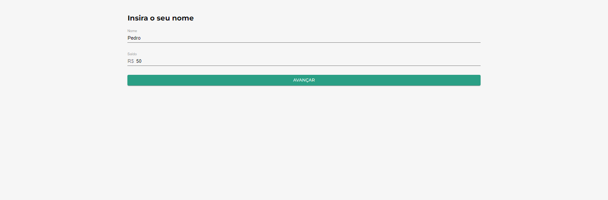
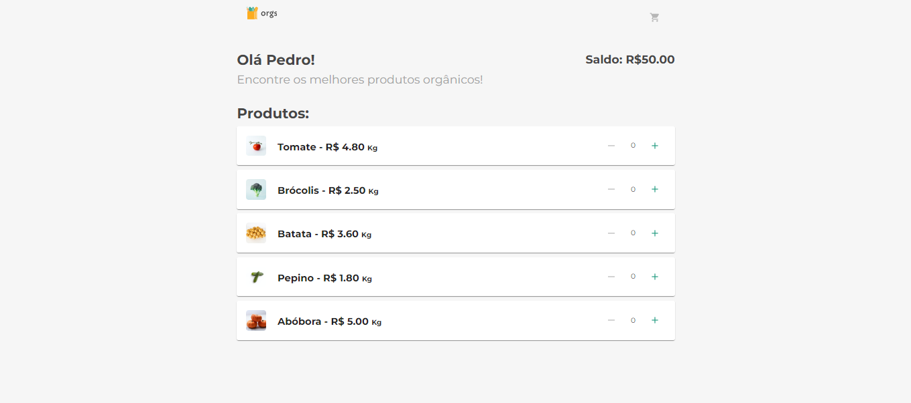
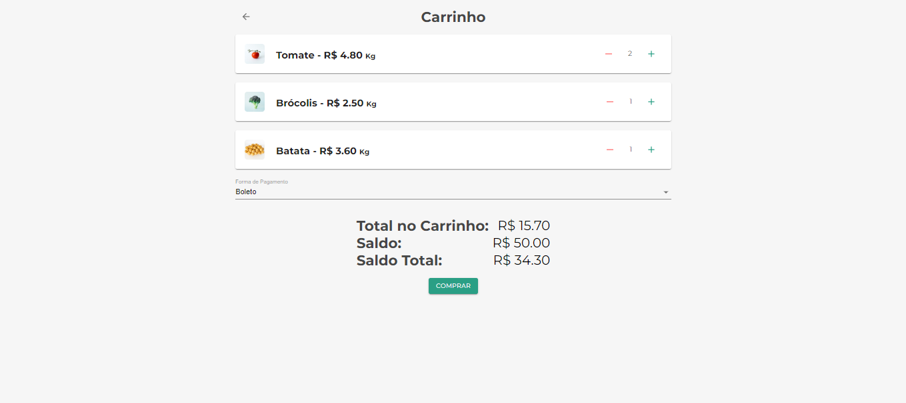

# Projeto ReactContext

Projeto desenvolvido durante o curso de React: gerenciamento de estados globais com ContextAPI

# Principais tecnologias utilizadas no projeto
* React
* NodeJs
* ContextAPI
* Material-UI
* Styled-Components

# Imagens do projeto

Pagina inicial do projeto

Pagina contendo os produtos ofertados com respectivos preços

Pagina contendo o carrinho com os produtos selecionados e formas de pagamento
